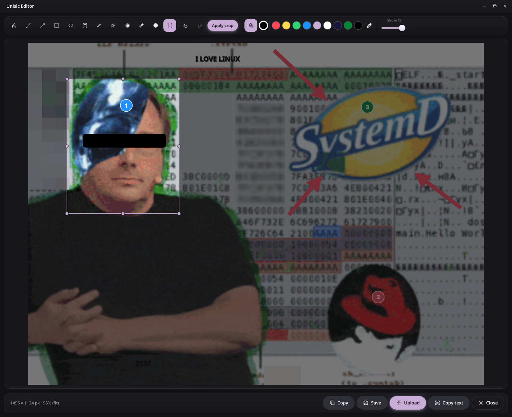
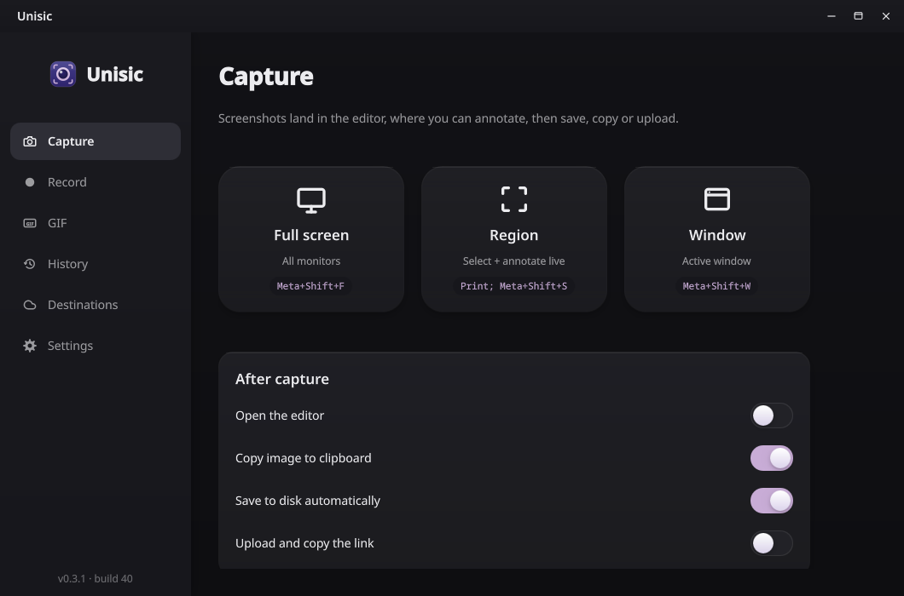
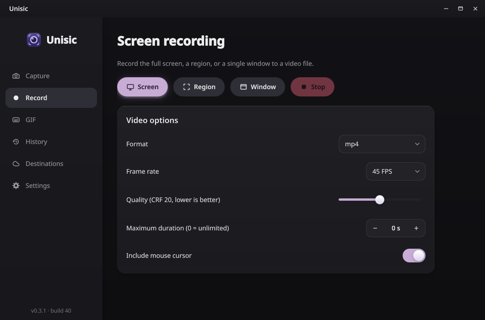
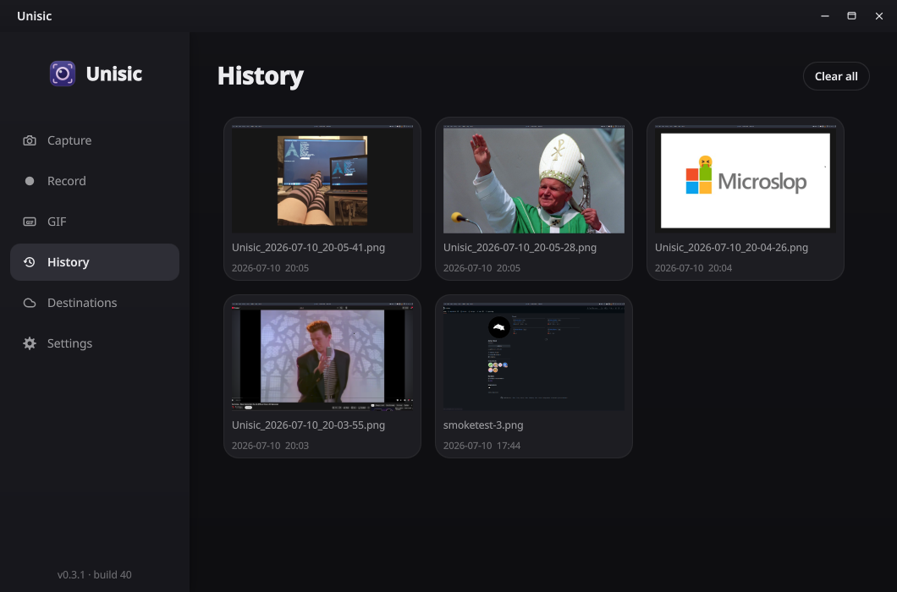
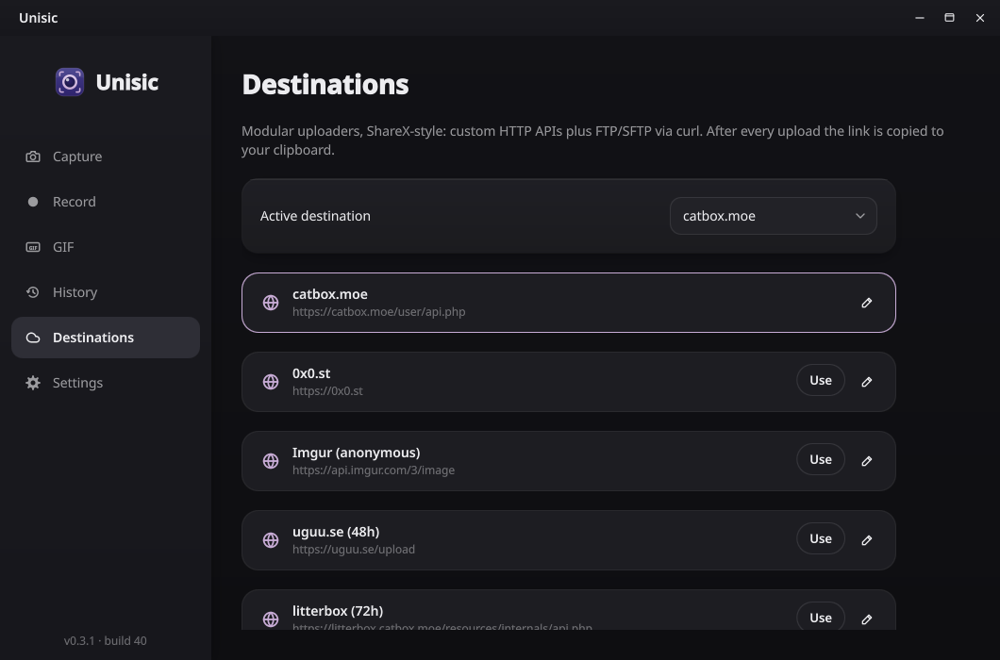

<div align="center">


# Unisic

**Most snipping tools stop at a primitive screenshot. Unisic is everything that should happen after.**

Silent capture · Annotate · Object cutout · Record GIF/MP4/WebM · Upload · Zero telemetry · GPLv3

[](https://github.com/unisic/unisic/releases/latest)

<p>
  
  
  
</p>







</div>

## What is Unisic

Most screenshot utilities on Linux give you a rectangle of pixels and walk away. Unisic covers the whole workflow the moment after you press the hotkey: annotate **on the selection overlay before the shot is even taken**, edit afterwards (blur, pixelate, numbered steps, crop, object cutout with background removal), record the same region as a GIF or video, and push the result wherever it belongs — clipboard, disk, or a custom upload destination with the link ready to paste.

Built for **Linux Wayland** on legitimate APIs only (xdg-desktop-portal, KWin ScreenShot2, PipeWire, KGlobalAccel, wlr-screencopy). KDE Plasma gets the fully silent native path; other desktops work through portals. **C++20 / Qt 6 / QML**, fully custom UI.

## Early developer access

Unisic is in **early developer access**. It works, but you *will* run into rough edges — capture quirks on exotic compositors, hotkey oddities, UI glitches. Every report helps: please file bugs (with your desktop, compositor, GPU, and logs if you can) in [**Issues**](https://github.com/unisic/unisic/issues). Feature requests welcome too.

## Install

**Recommended: install from a repository** (sections below) — updates then arrive automatically through your package manager like any other package. The [**Releases**](https://github.com/unisic/unisic/releases/latest) page also has a standalone **AppImage** that updates itself in-app; every packaged format (deb, rpm, Arch, openSUSE) ships through the repositories below. Requires a Wayland session with `xdg-desktop-portal` + a backend; recording additionally needs PipeWire and `ffmpeg`. Or [build from source](#build-from-source).

### Fedora (COPR)

On Fedora, install from the [`deandark/Unisic`](https://copr.fedorainfracloud.org/coprs/deandark/Unisic/) COPR repository — you get automatic updates through `dnf`:

```sh
sudo dnf copr enable deandark/Unisic
sudo dnf install unisic
```

The COPR build pulls in the optional deps (PipeWire, Tesseract, onnxruntime) so recording, OCR and U-2-Net background removal all work out of the box.

### Debian / Ubuntu (OBS repo)

Auto-updating signed repository built on the [openSUSE Build Service](https://software.opensuse.org/download.html?project=home:unisic&package=unisic). Needs a release with Qt 6.5+: Debian 13, Ubuntu 25.10 / 26.04 (25.10 reaches EOL in July 2026 — prefer 26.04).

```sh
REPO=Debian_13   # or xUbuntu_26.04 / xUbuntu_25.10
curl -fsSL "https://download.opensuse.org/repositories/home:/unisic/${REPO}/Release.key" \
  | gpg --dearmor | sudo tee /etc/apt/keyrings/home_unisic.gpg > /dev/null
echo "deb [signed-by=/etc/apt/keyrings/home_unisic.gpg] https://download.opensuse.org/repositories/home:/unisic/${REPO}/ ./" \
  | sudo tee /etc/apt/sources.list.d/home_unisic.list
sudo apt update && sudo apt install unisic
```

### openSUSE (OBS repo)

```sh
# Tumbleweed (for Leap 16.0 replace openSUSE_Tumbleweed with 16.0)
sudo zypper addrepo https://download.opensuse.org/repositories/home:unisic/openSUSE_Tumbleweed/home:unisic.repo
sudo zypper refresh   # accept the repo signing key
sudo zypper install unisic
```

### Arch (OBS repo)

Same OBS project publishes a signed pacman repository (no AUR needed):

```sh
curl -fsSL 'https://build.opensuse.org/projects/home:unisic/signing_keys/download?kind=gpg' -o /tmp/unisic-obs.key
sudo pacman-key --add /tmp/unisic-obs.key
sudo pacman-key --lsign-key "$(gpg --show-keys --with-colons /tmp/unisic-obs.key | awk -F: '/^fpr/{print $10; exit}')"
printf '\n[home_unisic_Arch]\nServer = https://download.opensuse.org/repositories/home:/unisic/Arch/$arch\n' \
  | sudo tee -a /etc/pacman.conf
sudo pacman -Syu unisic
```

## Updates

Unisic checks GitHub for a new release shortly after startup and once a day
(Settings → General → Updates; only the latest release version is fetched,
nothing else is sent) and updates fully automatically:

| Package | How it updates |
|---|---|
| **COPR (Fedora)** | `sudo dnf upgrade` — the repo ships new builds like any other `dnf` package. |
| **OBS repos (Debian, Ubuntu, openSUSE, Arch)** | Native system updates — `apt upgrade` / `zypper up` / `pacman -Syu` pick up every release automatically. |
| **AppImage** | The app downloads the new AppImage and swaps itself in place, then restarts when idle — no clicks needed. (`.zsync` for [`AppImageUpdate`](https://github.com/AppImageCommunity/AppImageUpdate) still ships too.) |

## Features

- **Capture** — full screen (all monitors stitched), interactive region on a frozen per-monitor overlay with live dimensions, or active window. Silent KWin path on Plasma, portal elsewhere, `grim` on wlroots compositors. Configurable delay + optional cursor.
- **Annotate before the shot** — draw on the frozen overlay (pen, arrow, shapes, text, blur, steps…) and the annotations are burnt into the final crop. Enter/double-click captures, Esc cancels.
- **Object cutout** — the *Pick object* tool segments the subject inside your selection and removes the background; export lands as transparent PNG/WebP.
- **Post-capture editor** — opens automatically (optional): 12 tools incl. highlight, pixelate, smart eraser, numbered steps, crop; zoom (Ctrl+scroll), undo/redo, everything composited in image-pixel space.
- **Recording** — GIF (two-pass palette) and MP4/WebM via ScreenCast portal → PipeWire → ffmpeg; region, full screen, or window. `Ctrl+Esc` is a fixed emergency stop.
- **Upload** — custom HTTP destinations (multipart or raw JSON body), `.sxcu` (ShareX uploader) import, FTP/SFTP via curl, built-ins (catbox, 0x0.st, Imgur…); link auto-copied.
- **History** — every capture with thumbnails; deleting moves the file to the trash; external deletions are picked up automatically.
- **Tray + hotkeys + 9 themes** — system light/dark following included; icons themable per tool.
- **Languages** — English and Polish; pick one in Settings → General (or follow the system locale).

## Default hotkeys

| Action | Shortcut |
| --- | --- |
| Capture full screen | `Meta+Shift+1` |
| Capture region | `Meta+Shift+2` |
| Capture active window | `Meta+Shift+3` |
| Record GIF (region) | `Meta+Shift+G` |
| Record video (region) | `Meta+Shift+R` |
| Stop recording (fixed) | `Ctrl+Esc` |

Editable in Settings → Hotkeys (applied to the system immediately) or in KDE's Shortcuts KCM.

## Build from source

Needs **Qt 6.5+**, CMake, Ninja.

**Fedora**
```sh
sudo dnf install -y cmake ninja-build gcc-c++ \
    qt6-qtbase-devel qt6-qtdeclarative-devel qt6-qtsvg-devel qt6-qtwayland \
    pipewire-devel ffmpeg wl-clipboard xdg-desktop-portal
```

**Debian / Ubuntu** (needs a release with Qt 6.5+: trixie / 24.10+)
```sh
sudo apt install cmake ninja-build g++ pkg-config \
    qt6-base-dev qt6-declarative-dev libqt6svg6-dev qt6-wayland \
    libpipewire-0.3-dev ffmpeg wl-clipboard xdg-desktop-portal
```

**Arch**
```sh
sudo pacman -S --needed base-devel qt6-base qt6-declarative qt6-svg qt6-wayland \
    pipewire ffmpeg wl-clipboard xdg-desktop-portal cmake ninja pkgconf
cd packaging/arch && makepkg -si   # or use the common build below
```

**Common build**
```sh
cmake -B build -G Ninja -DCMAKE_BUILD_TYPE=Release
cmake --build build
./build/unisic
```

PipeWire, Tesseract and onnxruntime dev packages are optional at build time — without them the app builds with recording / OCR / U-2-Net background removal disabled (the dependency-free heuristic object cutout still works). To enable AI background removal install `onnxruntime-devel` (Fedora) or `onnxruntime` (Arch) and rebuild; the ~4.5 MB U-2-Net model is fetched on first use.

## Run

```sh
unisic --fullscreen | --region | --window | --gif
unisic --export-settings <file> | --import-settings <file>
```

No arguments = background start with tray + main window. A second invocation forwards the command to the running instance (that's how compositor-side keybinds work).

## Configuration

- Settings/destinations: `~/.config/unisic/` · history: `~/.local/share/unisic/`.
- Filename template tokens: `%date%`, `%time%`, `%datetime%`, `%unix%`, `%rand%`; formats PNG/JPG/WebP.
- Custom capture sounds: drop `.wav`/`.ogg` files into `~/.config/unisic/sounds/` (or use *Add custom sound* in Settings → General) and pick them in the capture-sound list.
- Full settings export/import as JSON.

## niri and other wlroots compositors

- **Screenshots:** install `grim`. niri's screenshot D-Bus API (which the GNOME portal proxies) fails with `internal error` on multi-monitor setups ([niri #117](https://github.com/niri-wm/niri/issues/117)); Unisic detects niri and captures through wlr-screencopy via `grim` — silent and multi-monitor-safe.
- **Hotkeys:** no KGlobalAccel / GlobalShortcuts portal there — bind keys in your compositor config; a running Unisic instance picks the command up. niri `config.kdl`:

  ```kdl
  binds {
      Mod+Shift+S { spawn "unisic" "--region"; }
      Print { spawn "unisic" "--fullscreen"; }
  }
  ```

## Development

Unisic is developed with agentic AI assistance (see [`AGENTS.md`](AGENTS.md) for the contributor guide those agents follow). Every generated change is read line by line and reviewed by the maintainer before it lands — the tooling speeds things up, but nothing merges unread, so the codebase stays free of unreviewed machine output and its usual mistakes. Bug reports are still the best safety net: if something slipped through, please [file an issue](https://github.com/unisic/unisic/issues).

## Notes

- On first run Unisic installs `app.unisic.Unisic.desktop` into `~/.local/share/applications` (declares `X-KDE-DBUS-Restricted-Interfaces=org.kde.KWin.ScreenShot2`) — this authorizes the silent KWin path. Without it captures still work through the portal.
- Brand palette: `#17153B` · `#2E236C` · `#433D8B` · `#C8ACD6`.
- License: **GNU GPL v3**.
