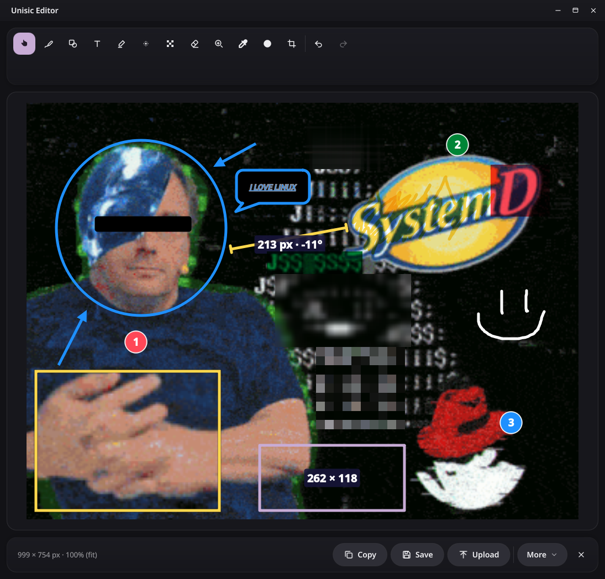
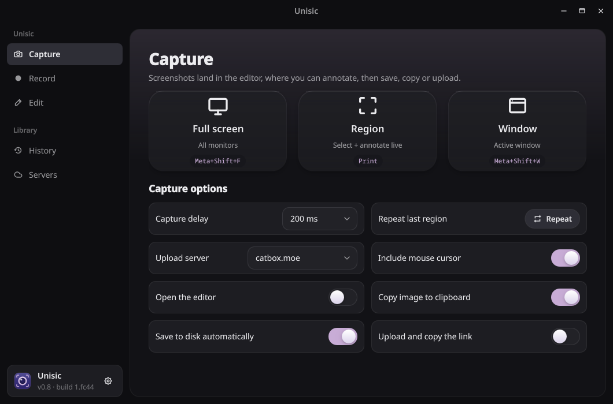
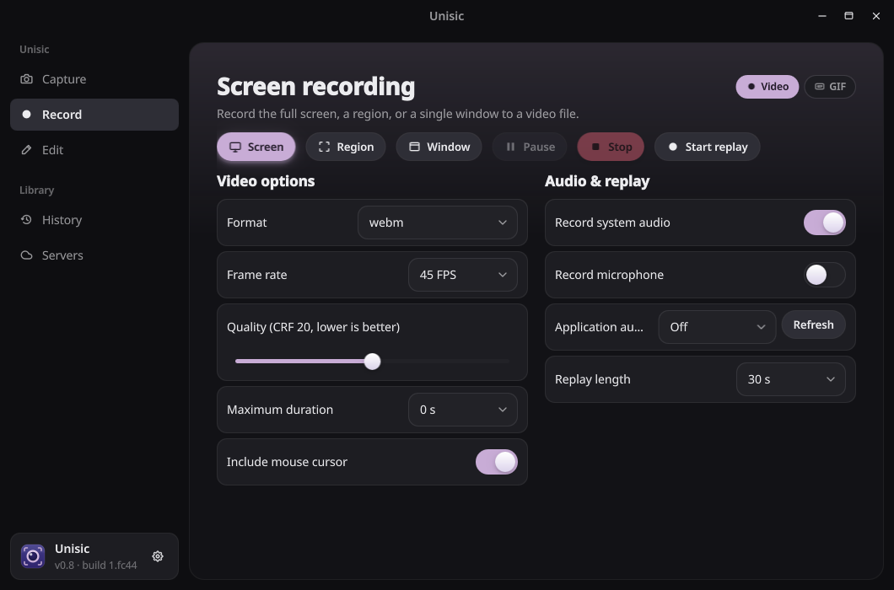
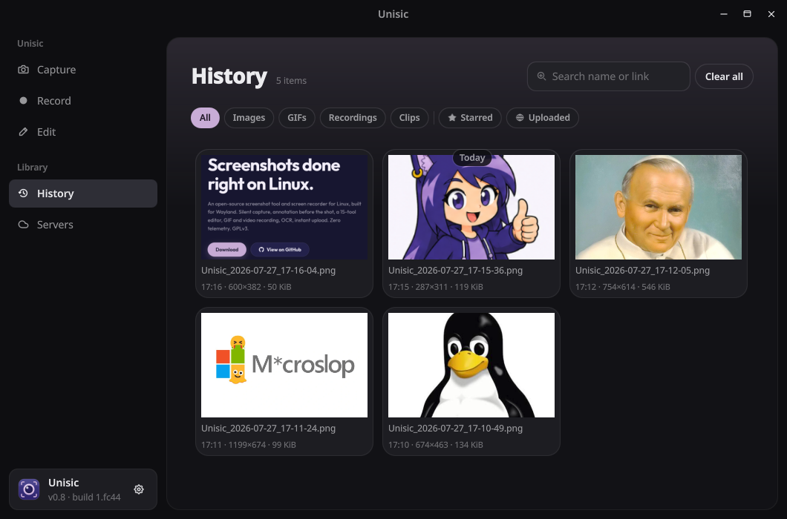
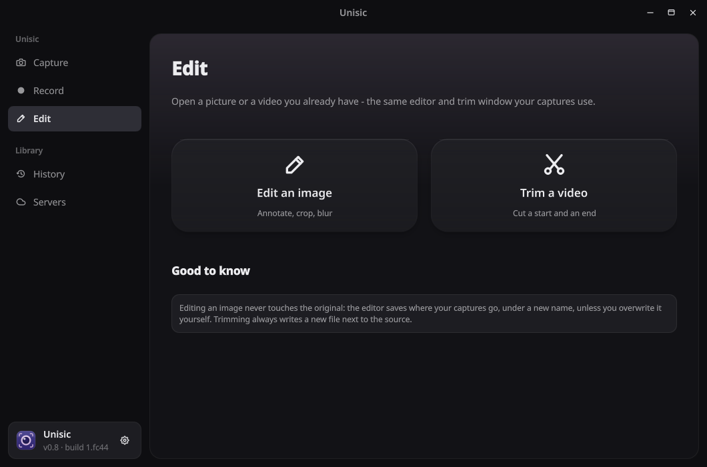

<div align="center">


# Unisic

### Most snipping tools stop at a screenshot.<br />Unisic is everything that should happen after.

Draw on the selection before the shot is taken · polish it in a 17-tool editor · record the same region as a GIF or video · read the text out of the pixels · paste the link. On Wayland, silently, with zero telemetry.

**[unisic.app](https://unisic.app)** · **[Documentation](https://unisic.app/docs)** · **[Discord](https://discord.gg/U2Eyw6xQBz)**

[](https://github.com/unisic/unisic/releases/latest)

<p>
  
  <a href="https://github.com/unisic/unisic/releases/latest"></a>
  <a href="https://github.com/unisic/unisic/releases"></a>
  
  <a href="https://discord.gg/U2Eyw6xQBz"></a>
</p>

[](https://ko-fi.com/deandark)

<br />







</div>

## Install in one line

```sh
bash -c "$(curl -fsSL https://github.com/unisic/unisic/releases/latest/download/install.sh)"
```

An arrow-key menu opens. The recommended entry puts the self-updating AppImage in `~/.local` - no password, no build, and Unisic updates itself in place from then on; the second one installs your distro's package instead (`.deb`, Fedora `.rpm`, Arch `.pkg.tar.zst`, the openSUSE repo) and asks for your password. Whatever is already installed is updated where it is, never duplicated. Nothing is installed until you pick it from the menu, and the script is never saved to your disk - it runs straight from memory. The same menu updates, uninstalls, installs an older version and toggles automatic updates. Every file it downloads is checked against the SHA-256 the release publishes for it, and a file that does not match is deleted instead of installed.

That URL is the copy attached to the newest release, not a branch that can change under you. Reading a script before piping it into a shell is a good habit, and here is the version of it that keeps the checksum intact:

```sh
curl -fsSLO https://github.com/unisic/unisic/releases/latest/download/install.sh
sha256sum install.sh                                        # what you got
curl -fsSL https://api.github.com/repos/unisic/unisic/releases/latest | tr -d '\n' \
  | grep -oE '"sha256:[0-9a-f]{64}"[^{}]*install\.sh"'      # what the release published
less install.sh && bash install.sh
```

By hand instead: grab the **AppImage** from the **[latest release](https://github.com/unisic/unisic/releases/latest)** - one file, no password, and it replaces itself when a new version appears, which is why the installer recommends it too. The native packages are on the same page and register their repo on first install, so from then on updates arrive through your package manager. Copy-paste repo snippets for Fedora COPR, Debian/Ubuntu, openSUSE, Arch and a Nix flake: **[unisic.app → Download](https://unisic.app/#download)** or the [installation docs](https://unisic.app/docs/installation).

## Press a hotkey, go

| Keys | Description |
| --- | --- |
| <kbd>Meta</kbd> + <kbd>Shift</kbd> + <kbd>1</kbd> | Capture the full screen |
| <kbd>Meta</kbd> + <kbd>Shift</kbd> + <kbd>2</kbd> | Capture a region |
| <kbd>Meta</kbd> + <kbd>Shift</kbd> + <kbd>3</kbd> | Capture the active window |
| <kbd>Meta</kbd> + <kbd>Shift</kbd> + <kbd>G</kbd> | Record a GIF (region) |
| <kbd>Meta</kbd> + <kbd>Shift</kbd> + <kbd>R</kbd> | Record video (region) |
| <kbd>Meta</kbd> + <kbd>Shift</kbd> + <kbd>T</kbd> | OCR - copy text out of a region |
| <kbd>Ctrl</kbd> + <kbd>Esc</kbd> | Stop recording (fixed emergency stop) |

Unisic lives in the tray, every hotkey is rebindable in Settings → Hotkeys, and the same actions run from the command line (`unisic --region | --fullscreen | --window | --gif`) - which is how a compositor keybind should call it. Docs: [full CLI](https://unisic.app/docs/configuration#command-line-interface), [file locations](https://unisic.app/docs/configuration#file-locations), [wlroots setup](https://unisic.app/docs/compositors).

## What it does

- **Capture** - full screen across all monitors, an interactive region with live dimensions, or the active window; configurable delay, optional cursor.
- **Annotate before the shot** - the selection overlay is already a canvas: arrows, shapes, text, blur and numbered steps on the frozen screen, burned into the crop on <kbd>Enter</kbd>.
- **Edit after it** - 17 tools including highlight, pixelate, smart eraser, magnifier, callout, rotatable shapes and crop, with undo/redo and zoom.
- **Record** - region, full screen or window → GIF, MP4 or WebM, with optional system and microphone audio.
- **Read pixels** - OCR any region to copy its text, or point it at a QR/barcode to copy the payload.
- **Share** - custom HTTP destinations, ShareX `.sxcu` import, FTP/SFTP, built-in hosts (catbox, Imgur…); the link auto-copies.
- **Remember** - every capture in a thumbnail history grid; deleting moves the file to the trash, not into the void.
- **Make it yours** - 9 themes (one follows your system light/dark scheme and accent color) and 7 languages: English, Polish, Spanish, Italian, French, Russian, German.

Built for **Linux Wayland** on legitimate APIs only - xdg-desktop-portal, KWin ScreenShot2, PipeWire. KDE Plasma gets the fully silent native path; GNOME and wlroots desktops go through portals ([compositor support](https://unisic.app/docs/compositors)). **C++20 · Qt 6 · QML**, fully custom UI, no Kirigami. No telemetry, no analytics, no account: the only request Unisic makes on its own is a release check against GitHub ([details](https://unisic.app/docs/introduction#privacy)).

<details>
<summary><b>X11 also works (best-effort second target)</b></summary>

<br />

Screenshots, the overlay, the editor, OCR, history and uploads are session-agnostic and always worked on X11. Since 0.8 the two paths that did not now do:

- **Screen recording** grabs frames from the X server with XShm instead of the ScreenCast portal, so it works even on desktops that ship no portal backend at all (Cinnamon, MATE, XFCE on Xorg). Cursor, click ripples and the keystroke badge come along; the record-region frame and the notification card are drawn as override-redirect windows.
- **Global hotkeys** use `XGrabKey` where KGlobalAccel is absent, so they no longer need the GlobalShortcuts portal.

One source stays Wayland-only: recording a **single window** needs the portal's window picker. Record the full screen or a region instead.

Development and daily use happen on Wayland, so X11 was verified by walking through the features once, on one desktop, not by living in it. Regressions there will not be noticed on their own - if something breaks, [file an issue](https://github.com/unisic/unisic/issues) with your desktop and window manager.

</details>

<details>
<summary><b>Build from source</b></summary>

<br />

Needs **Qt 6.5+**, CMake and Ninja:

```sh
cmake -B build -G Ninja -DCMAKE_BUILD_TYPE=Release
cmake --build build && ./build/unisic
```

Per-distro dev packages and the optional features (recording, OCR) are listed in [CONTRIBUTING.md](CONTRIBUTING.md#building).

</details>

## Contributing

Issues and pull requests welcome. Found a bug? [File an issue](https://github.com/unisic/unisic/issues) with your desktop, compositor, GPU and logs. [CONTRIBUTING.md](CONTRIBUTING.md) has the project layout. Unisic is developed with agentic AI assistance ([AGENTS.md](AGENTS.md)); every generated change is read line by line and reviewed by the maintainer before it lands.

Licensed **GNU GPL v3** - see [LICENSE](LICENSE) and [what that means](https://unisic.app/docs/introduction#license). Built by [@DeBondor](https://github.com/DeBondor) & [@D3anDark](https://github.com/D3anDark), inspired by [Flameshot](https://flameshot.org/) and [Spectacle](https://apps.kde.org/spectacle/).

<div align="center">
<br />


*Uni approves this capture.*

</div>
