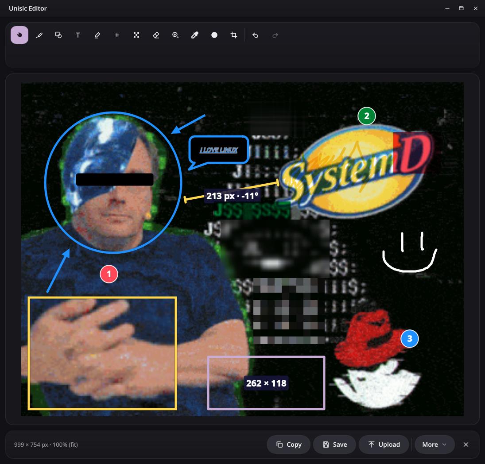
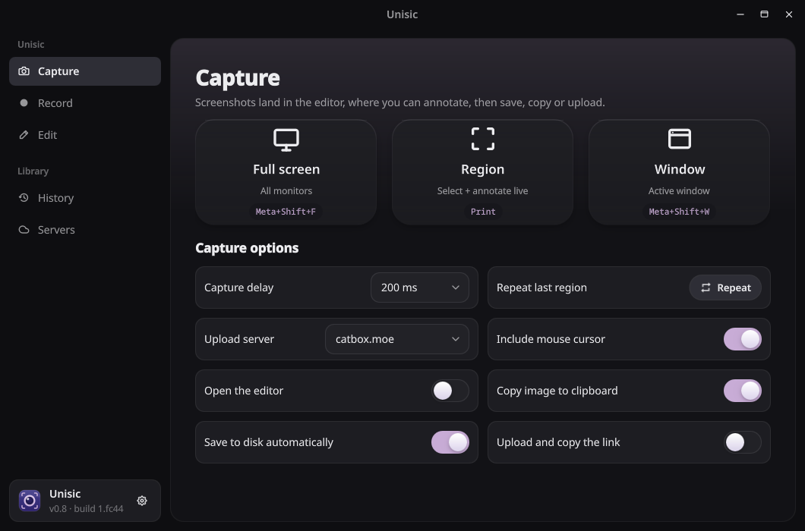
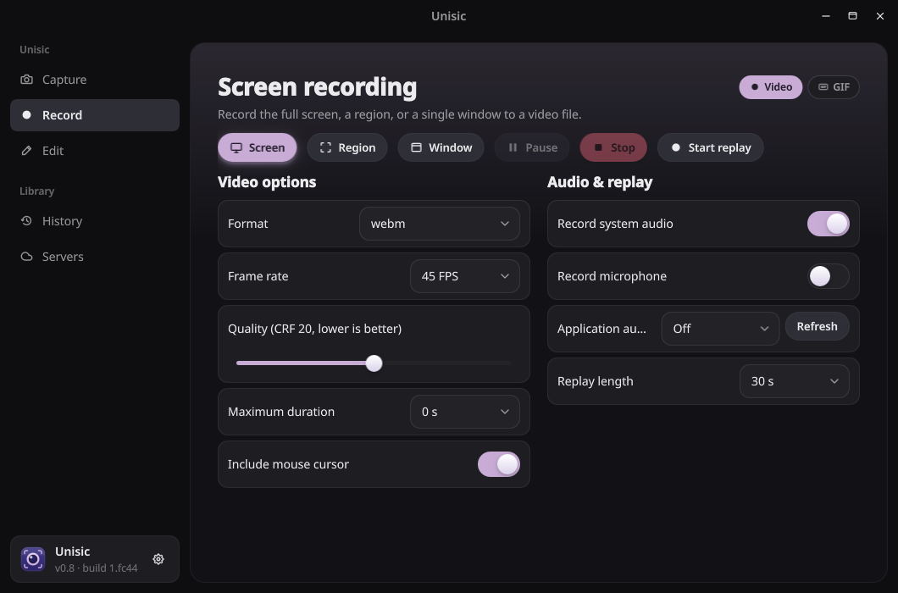
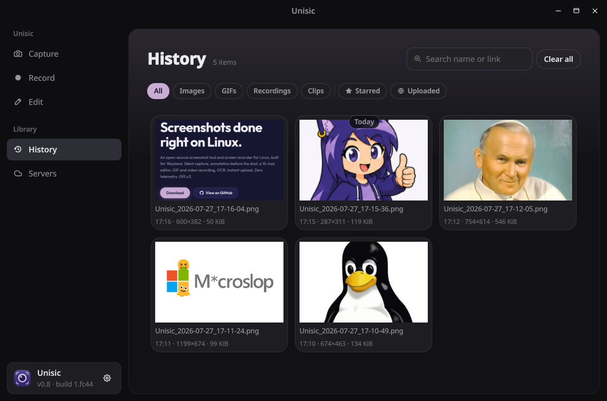
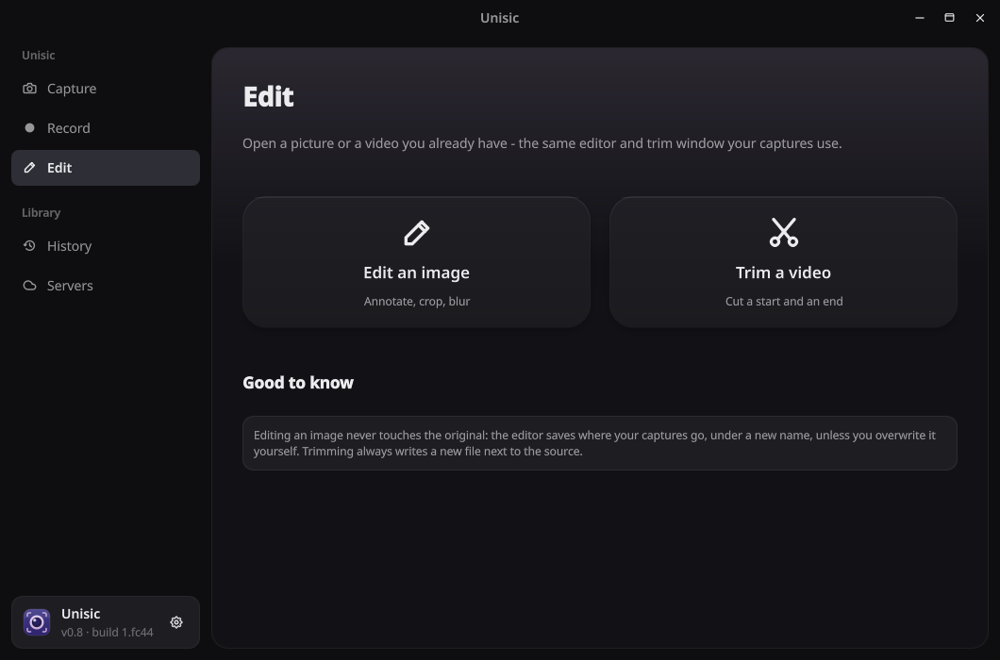

<div align="center">


# Unisic

### Most snipping tools stop at a screenshot.<br />Unisic is everything that should happen after.

Draw on the selection before the shot is taken · polish it in the editor · record the same region as a GIF or video · read the text out of the pixels · paste the link. On Wayland, silently, with zero telemetry.

**[unisic.app](https://unisic.app)** · **[Documentation](https://unisic.app/docs)** · **[Discord](https://discord.gg/U2Eyw6xQBz)**

[](https://github.com/unisic/unisic/releases/latest)

<p>
  
  <a href="https://github.com/unisic/unisic/releases/latest"></a>
  <a href="https://github.com/unisic/unisic/releases"></a>
  
  <a href="https://discord.gg/U2Eyw6xQBz"></a>
</p>

[](https://ko-fi.com/deandark)

<br />







</div>

## Install in one line

```sh
bash -c "$(curl -fsSL https://github.com/unisic/unisic/releases/latest/download/install.sh)"
```

An arrow-key menu opens. The recommended entry installs the self-updating AppImage in `~/.local` - no password, no build. The other installs your distro's package (`.deb`, Fedora `.rpm`, Arch `.pkg.tar.zst`, the openSUSE repo) and asks for your password. The same menu updates, uninstalls, installs an older version and toggles automatic updates. Every download is checked against the SHA-256 published with the release, and a mismatch is deleted instead of installed.

To read the script before running it: `curl -fsSLO https://github.com/unisic/unisic/releases/latest/download/install.sh`, then `less install.sh && bash install.sh`.

By hand: grab the **AppImage** or a native package from the **[latest release](https://github.com/unisic/unisic/releases/latest)**. Install downloaded packages with `sudo dnf install ./unisic-*.fedora.x86_64.rpm` or `sudo apt install ./unisic_*_amd64.deb` so dependencies get resolved. Repo snippets for Fedora COPR, Debian/Ubuntu, openSUSE, Arch and Nix: **[unisic.app → Download](https://unisic.app/#download)** or the [installation docs](https://unisic.app/docs/installation).

## Press a hotkey, go

| Keys | Description |
| --- | --- |
| <kbd>Meta</kbd> + <kbd>Shift</kbd> + <kbd>1</kbd> | Capture the full screen |
| <kbd>Meta</kbd> + <kbd>Shift</kbd> + <kbd>2</kbd> | Capture a region |
| <kbd>Meta</kbd> + <kbd>Shift</kbd> + <kbd>3</kbd> | Capture the active window |
| <kbd>Meta</kbd> + <kbd>Shift</kbd> + <kbd>G</kbd> | Record a GIF (region) |
| <kbd>Meta</kbd> + <kbd>Shift</kbd> + <kbd>R</kbd> | Record video (region) |
| <kbd>Meta</kbd> + <kbd>Shift</kbd> + <kbd>T</kbd> | OCR - copy text out of a region |
| <kbd>Ctrl</kbd> + <kbd>Esc</kbd> | Stop recording (fixed emergency stop) |

Every hotkey is rebindable in Settings → Hotkeys. The same actions run from the command line (`unisic --region | --fullscreen | --window | --scroll | --gif`, see `unisic --help`), which is how a compositor keybind should call it. Docs: [full CLI](https://unisic.app/docs/configuration#command-line-interface), [file locations](https://unisic.app/docs/configuration#file-locations), [wlroots setup](https://unisic.app/docs/compositors).

## What it does

- **Capture** - full screen across monitors, an interactive region with live dimensions, the active window, or a scrolling capture of a page taller than the screen; optional delay and cursor.
- **Annotate before the shot** - the selection overlay is already a canvas: arrows, shapes, text, blur and numbered steps, burned into the crop on <kbd>Enter</kbd>.
- **Edit after it** - highlight, pixelate, eraser, magnifier, callout, crop, undo/redo and zoom.
- **Record** - region, full screen or window to GIF, MP4 or WebM, with optional system and microphone audio.
- **Read pixels** - OCR any region or scan a QR/barcode, and copy the result.
- **Share** - custom HTTP destinations, ShareX `.sxcu` import, FTP/SFTP and built-in hosts; the link auto-copies.
- **Remember** - thumbnail history of every capture; deleting moves the file to the trash.
- **Make it yours** - themes (one follows your system light/dark scheme and accent color) and a translated interface.

Built for **Linux Wayland** on legitimate APIs only - xdg-desktop-portal, KWin ScreenShot2, PipeWire. KDE Plasma gets the fully silent native path; GNOME and wlroots desktops go through portals ([compositor support](https://unisic.app/docs/compositors)). No telemetry, no analytics, no account: the only request Unisic makes on its own is a release check against GitHub ([details](https://unisic.app/docs/introduction#privacy)).

<details>
<summary><b>X11 also works (best-effort second target)</b></summary>

<br />

Screenshots, the overlay, the editor, OCR, history and uploads work the same as on Wayland. Screen recording grabs frames from the X server (XShm), so it works even on desktops with no portal backend, and global hotkeys use `XGrabKey` where KGlobalAccel is absent. Recording a single **window** stays Wayland-only (it needs the portal's window picker); record the full screen or a region instead.

Daily use happens on Wayland, so X11 was verified by walking through the features once, on one desktop. If something breaks, [file an issue](https://github.com/unisic/unisic/issues) with your desktop and window manager.

</details>

<details>
<summary><b>Build from source</b></summary>

<br />

Needs **Qt 6.5+** (with QtWayland, the GUI private headers and Linguist tools), CMake, Ninja, PipeWire, Tesseract + Leptonica, zxing-cpp, LayerShellQt, KF6GuiAddons, libinput, plasma-wayland-protocols and the X11 development packages.

```sh
cmake -B build -G Ninja -DCMAKE_BUILD_TYPE=Release
cmake --build build && ./build/unisic
```

Every dependency is required: configure stops and names the missing package instead of building a Unisic with a feature quietly absent. Dev-package lines for Fedora, Debian/Ubuntu and Arch are in [CONTRIBUTING.md](CONTRIBUTING.md#building).

</details>

## Contributing

Issues and pull requests welcome. For a bug, [file an issue](https://github.com/unisic/unisic/issues) with your desktop, compositor, GPU and logs. [CONTRIBUTING.md](CONTRIBUTING.md) has the project layout. Unisic is developed with agentic AI assistance ([AGENTS.md](AGENTS.md)); every generated change is read line by line and reviewed by the maintainer before it lands.

Licensed **GNU GPL v3** - see [LICENSE](LICENSE) and [what that means](https://unisic.app/docs/introduction#license). Built by [@DeBondor](https://github.com/DeBondor) & [@D3anDark](https://github.com/D3anDark), inspired by [ShareX](https://getsharex.com/) and [Spectacle](https://apps.kde.org/spectacle/).

<div align="center">
<br />


*Uni approves this capture.*

</div>
